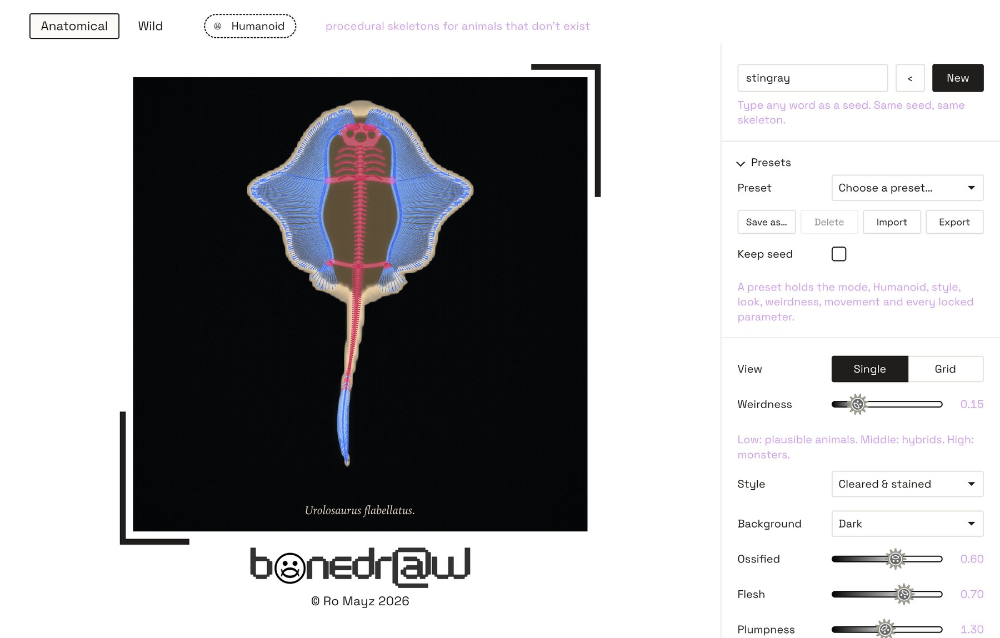
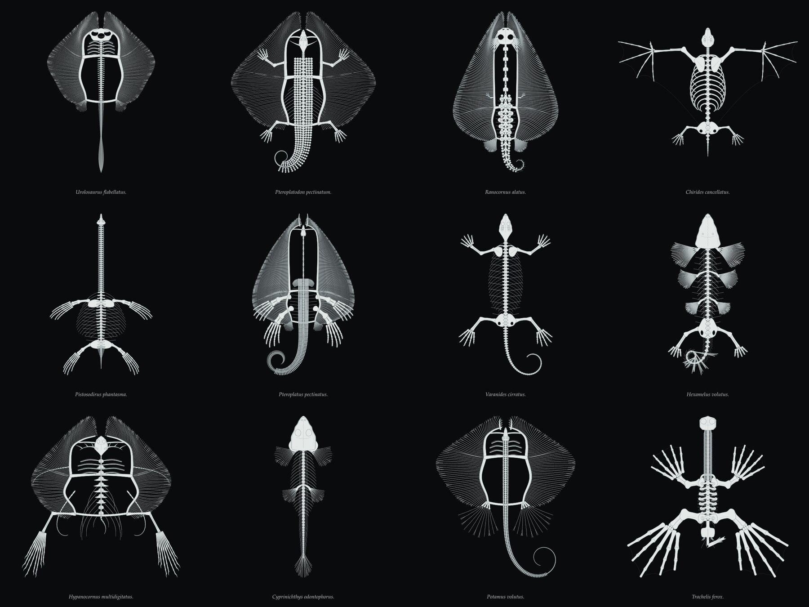
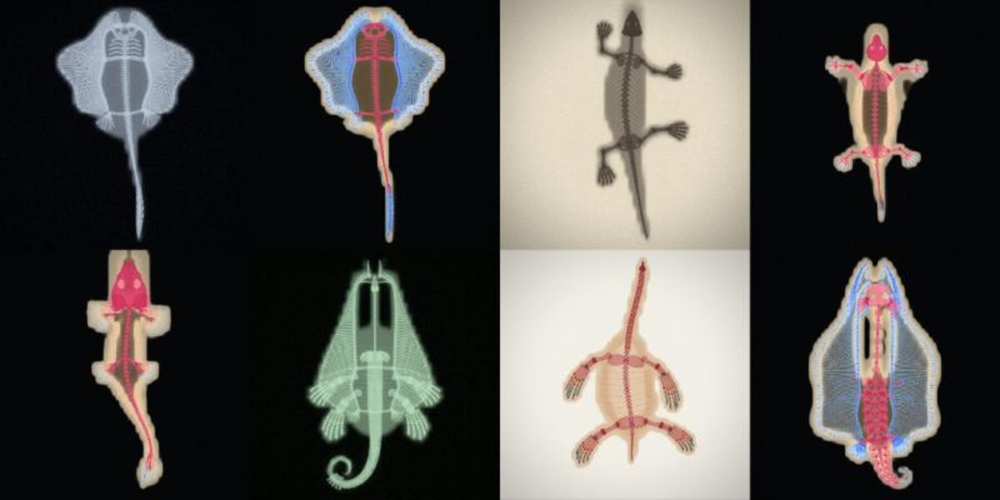

# bonedraw



Procedural skeletons for animals that don't exist. Every seed gives a different,
reproducible skeleton with its own Latin name, built as a working **rig** of bones
and joints. You can animate it, render it as engraved line art, as a white-on-black
specimen, as an X-ray, or as a cleared-and-stained museum specimen, and export it as
an image, a video, a looping GIF or the rig itself.



## What it does

- **Generates** nine body plans (ray, bony fish, serpent, lizard, turtle, bat, mammal,
  frog, sea reptile) from one shared anatomy, so a lizard can grow a ray's disc and a
  frog can grow wings. A **Weirdness** slider runs from plausible animals to monsters.
- **Humanoid mode**: a toggle that lets a standing skeleton with the smiler's skull into
  the pool, and spreads its skull, arms and legs to the other creatures.
- **Animates** every skeleton, moving each joint within its own limits: swimming,
  slithering, walking, flapping, a stingray's fin ripple, breathing ribs, writhing.
- **Renders** in four styles: line art, specimen, X-ray, and cleared & stained.
- **Exports** PNG, SVG, MP4, looping GIF and rig JSON for TouchDesigner or Blender, with
  savable and shareable presets.



## Get it

**Mac:** download the `.dmg` for your Mac (Apple Silicon: `mac-arm64`, Intel:
`mac-x64`) from the releases page, open it and drag **bonedraw** to Applications.
The app isn't notarised by Apple, so the first time you open it, right-click it,
choose **Open**, and confirm. If macOS says the app is damaged, run
`xattr -cr /Applications/bonedraw.app` once.

**Windows:** the `.exe` installer from the releases page (built by the workflow in
`.github/workflows/build.yml`). Windows SmartScreen may warn about an unknown publisher:
choose *More info*, then *Run anyway*.

**In a browser:** no install needed.

```
git clone <this repo> && cd bonedraw
python3 tools/serve.py        # then open http://localhost:8766
```

Use a recent Chrome, Edge or Safari. Video export needs WebCodecs and the X-ray and
cleared looks need WebGL2; the desktop app has both.

## Quick start

1. Press **New** (or space) for a new creature, or type any word as a seed.
2. Drag **Weirdness**. Change any parameter and it stays locked when you press New.
3. Pick a **Style**, then a **Movement** under Motion to bring it to life.
4. Under **Export**, choose MP4 or GIF for a seamless loop, or PNG for a still.
5. **Presets** saves the whole setup so you can come back to it.

Next: **[the guide](docs/guide.md)** for every control, **[how it works](docs/how-it-works.md)**
for the anatomy, rig, motion and looks, **[the rig format](docs/rig-format.md)** for using
skeletons in other tools, and **[development](docs/development.md)** for the code layout,
the command line and how the app is packaged.

## Credits and licences

- Space Grotesk, © 2020 The Space Grotesk Project Authors, SIL Open Font License 1.1.
- [mp4-muxer](https://github.com/Vanilagy/mp4-muxer) © 2023 Vanilagy, MIT.
- [gifenc](https://github.com/mattdesl/gifenc) © 2017 Matt DesLauriers, MIT.
- Electron, MIT, for the desktop app.

Full notices are in [THIRD_PARTY_NOTICES.md](THIRD_PARTY_NOTICES.md).

bonedraw, the logo and the smiler are © Ro Mayz 2026. All rights reserved.
